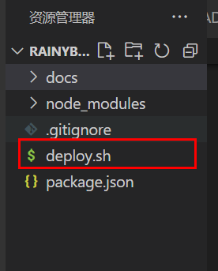
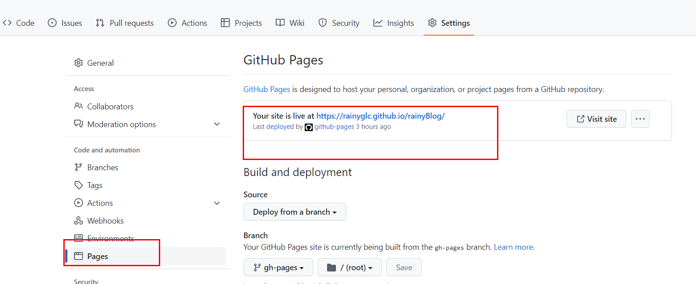

# VuePress 从0开始搭建个人网站

> RaingBlog 从无到有的全过程
>
>[VuePress 官网](https://vuepress.vuejs.org/zh/)

## 体验VuePress

1.安装本地依赖

```bash
npm install -D vuepress
```
2.创建并进入新目录

```bash
mkdir raingBlog
cd raingBlog
```

3.初始化  - 将会创建一个package.json文件
```bash
npm init
```
5.创建你的第一篇文档
```
mkdir docs
echo '#Hello VuePress' > docs/README.md
```
6.在`package.json`文件中 `scripts`

```json
{
  "scripts": {
    "dev": "vuepress dev docs",
    "build": "vuepress build docs"
  }
}
```
7.启动本地服务器
```bash
 npm run dev
```
8.浏览器打开服务器给的地址

## 目录结构

以下为 rainyBlog 部分目录结构，比较重要的是 `.vuepress` 目录的结构。官方目录结构请移步 [→](https://vuepress.vuejs.org/zh/guide/directory-structure.html)

    .
    ├── docs
    │   ├── .vuepress
    │   │   ├── public
    |   |   |   └── img
    │   │   ├── styles
    │   │   │   └── index.styl
    │   │   ├── nav.js
    │   │   ├── sidebar.js
    │   │   └── config.js
    |   |
    │   ├── framework
    │   │   ├── vue
    |   │   │   ├── images
    |   │   │   ├── sidebar.js
    |   │   │   ├── vuex.md
    |   │   │   ├── vue3.md
    |   │   │   └── ...
    |   |   |
    |   |   ├── react
    |   │   │   ├── images
    |   │   │   ├── sidebar.js
    |   │   │   ├── react-cli.md
    |   │   │   └── ...
    |   │   │
    |   │   ├── ...
    |   |   |
    │   │   └── README.md
    |   |
    │   └── README.md
    │
    ├── .gitignore
    |
    └── package.json

## `config.js` 文件配置

每个配置的作用都写在注释当中。

官方文档：[配置](https://vuepress.vuejs.org/zh/config/)、[插件](https://vuepress.vuejs.org/zh/plugin/)、[默认主题配置](https://vuepress.vuejs.org/zh/theme/default-theme-config.html)

```js
module.exports = {
  // 插件：置顶按钮、图片缩放
  plugins: ['@vuepress/back-to-top', '@vuepress/medium-zoom'],
  // 自定义网站 favicon
  head: [['link', { rel: 'icon', href: '/img/logo.png' }]],
  // 根路径，和仓库名一致
  base: '/bruceblog/',
  // 左上角标题
  title: 'BruceBlog',
  // markdown 相关配置
  markdown: {
    // 代码块行号
    lineNumbers: true,
  },
  // 默认主题相关配置
  themeConfig: {
    // 配置左上角的 logo
    logo: '/img/logo.png',
    // 导航栏
    nav: require('./nav.js'),
    // 侧边栏
    sidebar: require('./sidebar.js'),
    // sidebar: 'auto',
    // 标题深度，2 表示提取 h2 和 h3 标题
    sidebarDepth: 2,
    // 启用页面滚动效果
    smoothScroll: true,
    // 最后更新时间
    lastUpdated: 'Last Updated',
    // 默认值是 true 。设置为 false 来禁用所有页面的 下一篇 链接
    nextLinks: true,
    // 默认值是 true 。设置为 false 来禁用所有页面的 上一篇 链接
    prevLinks: true,
    // 导航栏显示 gitee 仓库
    repo: 'https://github.com/rainyGLC/rainyBlog/tree/gh-pages',
    repoLabel: 'github',
  },
}
```

## 首页

`docs/README.md`文档：

```yaml
---
home: true
heroImage: /img/logo.jpg
actionText: How to Build raingBlog →
actionLink: /blog/vuepress/
features:
- title: 前端基本知识
  details: HTML、CSS、JavaScript、TypeScript、Vue、React
- title: 计算机基础知识
  details: 计算机网络、数据结构、算法、操作系统
- title: 乱七八糟
  details: 常见错误、注意事项、常见面试题
footer: MIT Licensed | Copyright © 2018-present Evan You
---
```

[官方文档](https://vuepress.vuejs.org/zh/theme/default-theme-config.html)

## 导航栏

这里没有直接把配置写在 `config.js` 文件中，而是提取成一个模块，便于后续维护，也避免 `config.js` 文件过于臃肿。

注意事项：

- 所有路径以 `/` 开头，`/` 代表 docs 目录
- 若没有指明具体文件，只有文件夹，则默认会寻找该文件夹下的 READMED.md 文档，如 `'/blog/'` → `'/blog/README.md'`

```js
// .vuepress/nav.js
module.exports = [
  {
    text: 'Guide',
    link: '/blog/guide/xxxx',
  },
  {
    text: '前端学习',
    items: [
      { text: 'HTML', link: '/fontend/html/html' },
      { text: 'CSS', link: '/fontend/css/css' },
    ],
  },
]
```

[官方文档](https://vuepress.vuejs.org/zh/theme/default-theme-config.html#%E5%AF%BC%E8%88%AA%E6%A0%8F)

## 侧边栏

rainyBlog 为不同页面显示不同的侧边栏，并且每个页面的侧边栏封装为一个模块便于后续维护。

以 Guide 页面的侧边栏为例：

```js
// .vuepress/sidebar.js
module.exports = {
  '/blog/guide': require('../blog/guide/sidebar'),
  '/blog/vuepress': require('../blog/vuepress/sidebar'),
}
```

```js
// blog/guide/sidebar.js
module.exports = [
  {
    title:'网站推荐',
    path:'/blog/guide/guide.md'
  },
  {
    title:'前端文章',
    path:'/blog/guide/frontend_blogs'
  },
  {
    title:'其他文章',
    path:'/blog/guide/other_blogs'
  }
]
```

[官方文档](https://vuepress.vuejs.org/zh/theme/default-theme-config.html#%E4%BE%A7%E8%BE%B9%E6%A0%8F)

## 修改默认样式

在 `.vuepress/styles/index.styl` 文件可以方便地添加自定义样式

```css
blockquote {
  border-left: 0.2rem solid #3eaf7c;
  font-weight: 700;
}
```

[官方文档](https://vuepress.vuejs.org/zh/config/#styling)

## Emoji

输入

```
:tada: :smile: :bowtie: :smile: :relaxed: :bulb: :revolving_hearts: :blush:
```

输出

:tada: :smile: :bowtie: :relaxed: :smile: :bulb: :revolving_hearts: :blush:

[Emoji 大全](https://www.webfx.com/tools/emoji-cheat-sheet/)

## 搭建过程踩的坑

- h1 标题不会生成目录，因此若想标题出现在目录，请用 h2 和 h3 标题
- 使用 `` 插入图片时，要填写标准的相对路径，如 `./images/xxx.png`，不要省略前面的 `./`，否则图片无法正常显示
- 在非代码块中（包括行内代码）不要使用紧贴的大括号，两个同向的大括号之间加个空格

```js
// 报错写法
style={{ key: value }}
// 不报错写法
style={ { key: value } }
```

- 侧边栏对应的文件路径要书写正确，否则侧边栏无法展示
- 若一个目录有 `README.md` 和 `sidebar.js` ，则其子目录文件夹不能再有
- 若其侧边栏目录只有单页面时，建立目录应为为`README.md`,不然侧边栏目录不会显示出来 
- 总之，如果页面展示出现问题，多看看控制台的报错，一般都会有提示

## 启动

```
npm run dev
```
http://localhost:8080/rainyBlog/


## 部署

本人选择部署到 GitHub，官方部署到 GitHub Pages 的[教程](https://vuepress.vuejs.org/zh/guide/deploy.html)，

1. 在 `docs/.vuepress/config.js` 中设置正确的 `base`。
```js
module.exports = {
  // 仓库名为 rainyBlog
  base: '/rainyBlog/',
}
```


若发布到 `https://<USERNAME>.github.io` ，可省略此步，因为 `base` 默认为 `"/"` 。

若发布到 `https://<USERNAME>.github.io/<REPO>/` ，`<REPO>` 为仓库名，则将 `base` 设置为 `"/<REPO>/"` 。

本人额外创建了一个分支，`master` 分支保存原始的 markdown 文档，`pages`分支则用于上传打包后的文件，并使用 `pages` 分支部署 Github Pages。

2. 在 `rainyBlog` 目录下运行打包命令

```bash
npm run build
```

3. 打包完成后，会生成 `dist` 文件夹，进入该文件夹

```bash
cd docs/.vuepress/dist
```

4. 初始化 git，并添加暂存区，提交本地库

```bash
git init
git add .
git commit -m "init rainyBlog"
```


6. 拉取代码

```bash
git pull origin gh-pages
```

2. 推送本地分支到远程分支
```bash
git push origin master:gh-pages
```


(自动部署，这只是第一步，还没完成可以自动部署操作)

1. 在 VuePress 项目的目录下，新建一个文件 deploy.sh



并在该文件中添加如下内容
```bash
  #!/usr/bin/env sh

  # 确保脚本抛出遇到的错误
  set -e

  # 生成静态文件
  npm run build

  # 进入生成的文件夹
  cd docs/.vuepress/dist

  # 如果是发布到自定义域名
  # echo 'www.example.com' > CNAME

  git init
  git add -A
  git commit -m 'deploy'

  # 如果发布到 https://<USERNAME>.github.io
  # git push -f git@github.com:<USERNAME>/<USERNAME>.github.io.git master

  # 如果发布到 https://<USERNAME>.github.io/<REPO>
  # 请把 rainyGLC/rainyBlog.git 换成你的项目地址
  git push -f git@github.com:rainyGLC/rainyBlog.git master:gh-pages

  cd -

```
2. 接下来在package.json文件中的插件部分,新增如下内容：
```js
"scripts": {
    "dev":"vuepress dev docs",
    "build":"vuepress build docs",
    "deploy":"bash deploy.sh"
},
```
4. 推送到GitHub
```bash
npm run deploy
```
5. 接下来去Github查看分支,如果有gh-pages分支，则说明推送成功

6. 选择部署分支，从GitHub服务器访问项目



<b>蓝色链接</b> 就是该项目的访问地址


至此，rainyBlog 的搭建大功告成！:tada::smile:


## 更新网站内容

> VuePress 每次打包生成的 dist 都不相同，因此尽量有比较大改动时才更新网站，这不像 docsify 那么方便自由

- 本地拷贝一份 `.git` 文件夹备用，删除旧的 `dist` 文件夹
- 重新打包生成新的 `dist` 文件夹
- 把备用 `.git` 文件夹拷贝到新的 `dist` 文件夹中
- 将修改添加暂存区，提交本地库，并推送到远程分支
- 如此，既能更新远程 `gh-pages` 分支内容，也能同步 git 的历史操作记录
